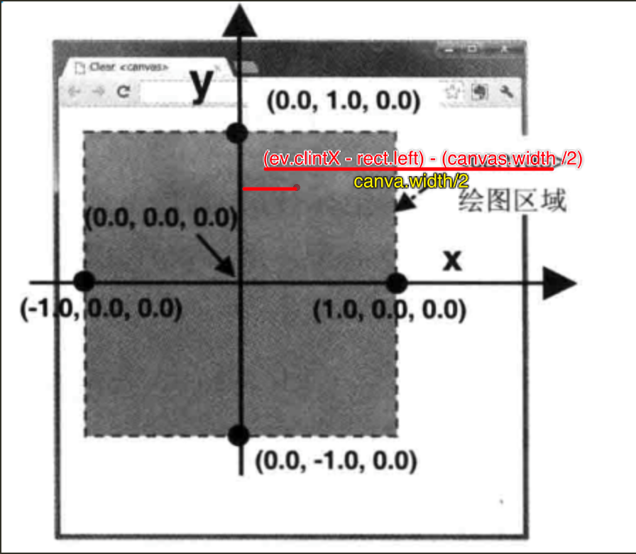

webgl 使用正交右手坐标系，且每个方向 x,y,z 为了减少开销，超出[-1,1]区间外的部分不会被绘制，与 canvas 的大小无关。

x 轴 从左到右，最左侧 -1，最右侧 1
y 轴 从下到上，最下侧 -1，最上侧 1
z 轴 从远离屏幕的方向指向屏幕外侧的方向，最远侧 -1，最近侧 1

如何转换窗体的坐标系到 webgl 的坐标系呢？

 

1. 鼠标在浏览器客户区点击的位置为：(event.clientX,event.clientY)
2. 那么在canvas中的坐标（x,y）就是：
var rect = event.target.getBoundingClientRect();
x = event.clientX-rect.left;
y = - (event.clientY-rect.top);
其中rect.left是canvas左边界距离浏览器客户区左边界的位置，rect.top是canvas上边界距离浏览器客户区上边界的位置，注意y坐标加符号是因为canvas中Y轴向下为正方向

3. 在webgl中的坐标位置(x,y)则为：
x = ( (event.clientX-rect.left) -canvas.width/2 )/(canvas.width/2);
y = (canvas.height/2 - (event.clientY-rect.top))/(canvas.height/2);
利用上一步从canvas坐标系转换到webgl坐标系，主要的工作就是需要将坐标范围映射到(-1,1)的范围，其次是注意webgl中Y轴向上是正方向

